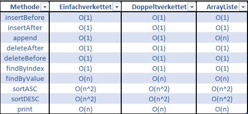

<h1>Verkettete Listen</h1>

Dieses Programm war eine Übung, um den Unterschied zwischen Einfach-Verketteten Listen, Doppelt Verketteten Listen und (Array)Listen zu verdeutlichen.

Es wurden verschiedenste Methoden zum Einfügen, Löschen, Finden oder Sortieren (mittels Insertionsort) ausprogrammiert.

Es wurden zusätzlich die Zeiten des Sortierens gemessen. Durch mehrfaches Testen war das Ergebnis immer ähnlich:
Das Sortieren einer zufällig generierten Double-Linked-List benötigte ca. 12 Sekunden. Das Sortieren derselben Zahlen in einer (Array)List hingegen im Schnitt 8 Sekunden.

Hier sieht man noch die Aufwandsklassen der jeweiligen Methoden.

